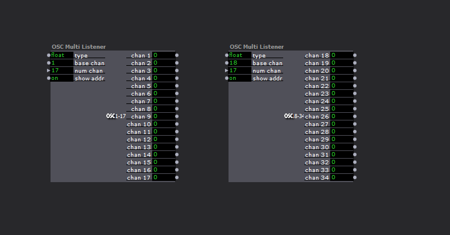
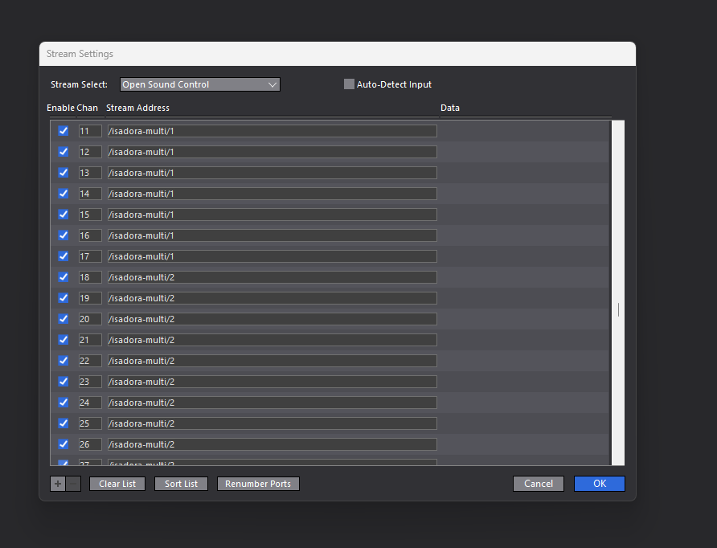

# Sending Coordinates to Isadora via OSC 

## Setting Up Isadora: 

1. Open Isadora

2. Double click on the canvas/blank space. Type in 'OSC Multi Listener'. 

3. Set up two OSC Multi Listeners (I used one for the x and one for the y coordinates of each keypoint).

4. Set the base channels to be 1 and 18 on the two multi-listeners. Also set the number of channels to be 17. The number of channels depends on the number of keypoints to be detected. Each multi-listener will have as many channels as there are keypoints to be detected. The base channel on the first OSC mullti-listener will always be 1. The base channel on the second multi-listener will be the next number after the last number on the first multi-listener.

5. Click on Communications and then Stream Setup (or use ctrl+9). Select 'Open Sound Control' in the 'Stream Select' field. Also select the Auto-Detect Input box.

6. Channels can be added using the '+' button on the bottom left corner. Add 34 channels (2 for each keypoint) and number them from 1-8. Less channels can be used if only a few keypoints are to be detected.

7. Enter '/isadora-multi/1' in the stream address field for the first 17 channels and '/isadora-multi/2' for the next 17 channels in order. 

8. Once all the stream addresses have been set up, click OK.

9. Run the program as you normally would. All x coordinates are sent to OSC Multi Listener 1 and all y coordinates are sent to OSC Multi Listener 2.

## Changing number of keypoints sent to Isadora:

1. Open main.py

2. Hit ctrl+F and type in 'kpt_list' or simply navigate to the initialization of kpt_list in the code. 

3. Change the contents of kpt_list to include any keypoints that are to be sent to Isadora. All the keypoints are listed in the keypoint_names list.

## Additional Resources

All additional resources are hyperlinked below.

### Isadora Resources

1. [Troikatronix Support Forum](https://support.troikatronix.com/support/home)

2. [Isadora User Manual](https://troikatronix.com/files/isadora-manual.pdf)

3. [Isadora Tutorials Youtube Playlist](https://youtube.com/playlist?list=PLqiBJCe8prQsB0quh0mOunT3iwH9DNr31&feature=shared) - For Isadora+OSC interaction specific tutorials [Session #9](https://www.youtube.com/live/THZCUXOFJdA?feature=shared) may be useful
### Open Sound Control Resources

1. [Open Sound Control Site](https://ccrma.stanford.edu/groups/osc/index.html) 

2. [UDP: Commonly used protocol for OSC transfer](https://datatracker.ietf.org/doc/html/rfc768) 

3. [python-osc: Python OSC connector package](https://pypi.org/project/python-osc/)